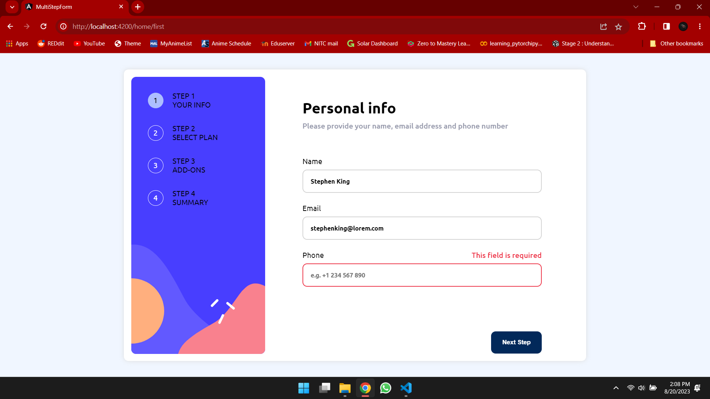

# Frontend Mentor - Multi-step form solution

This is a solution to the [Multi-step form challenge on Frontend Mentor](https://www.frontendmentor.io/challenges/multistep-form-YVAnSdqQBJ). Frontend Mentor challenges help you improve your coding skills by building realistic projects. 

## Table of contents

- [Overview](#overview)
  - [The challenge](#the-challenge)
  - [Screenshot](#screenshot)
  - [Links](#links)
- [My process](#my-process)
  - [Built with](#built-with)
  - [What I learned](#what-i-learned)
  - [Useful resources](#useful-resources)
- [Author](#author)
- [Acknowledgments](#acknowledgments)

## Overview

### The challenge

Users should be able to:

- Complete each step of the sequence
- Go back to a previous step to update their selections
- See a summary of their selections on the final step and confirm their order
- View the optimal layout for the interface depending on their device's screen size
- See hover and focus states for all interactive elements on the page
- Receive form validation messages if:
  - A field has been missed
  - The email address is not formatted correctly
  - A step is submitted, but no selection has been made

### Screenshot

### Links

- Live Site URL: [Github Pages](https://th3bossc.github.io/MultiStepForm-FrontendMentor/)

## My process

### Built with

- Semantic HTML5 markup
- CSS custom properties
- Flexbox
- CSS Grid
- Mobile-first workflow
- [AngularJS](https://angular.io/) - JS library
- [Sass](https://sass-lang.com) - CSS Preprocessor
- [Styled Components](https://styled-components.com/) - For styles

### What I learned

Throughout the project, I had to work with data being passed from component to component, and saving state. I learnt how to efficiently pass data from one component to another, and how to create UI that looks good not just in Desktop, but mobile UI as well

### Useful resources

- [Angular Documentation](https://angular.io/docs) - Angular documentation helped me a lot when working with projects, and needed to know how a specific feature was used, and the best way to use it.

## Author

- Website - [Diljith P D](https://th3bossc.github.io/Portfolio)
- Frontend Mentor - [@th3bossc](https://www.frontendmentor.io/profile/th3bossc)

## Acknowledgments

I thank my collegues for helping me in the challenges i faced, as well as the youtube channels, Kevin Powell and webdevsimplified for the robust frontend tips which came in handy while working on this website
